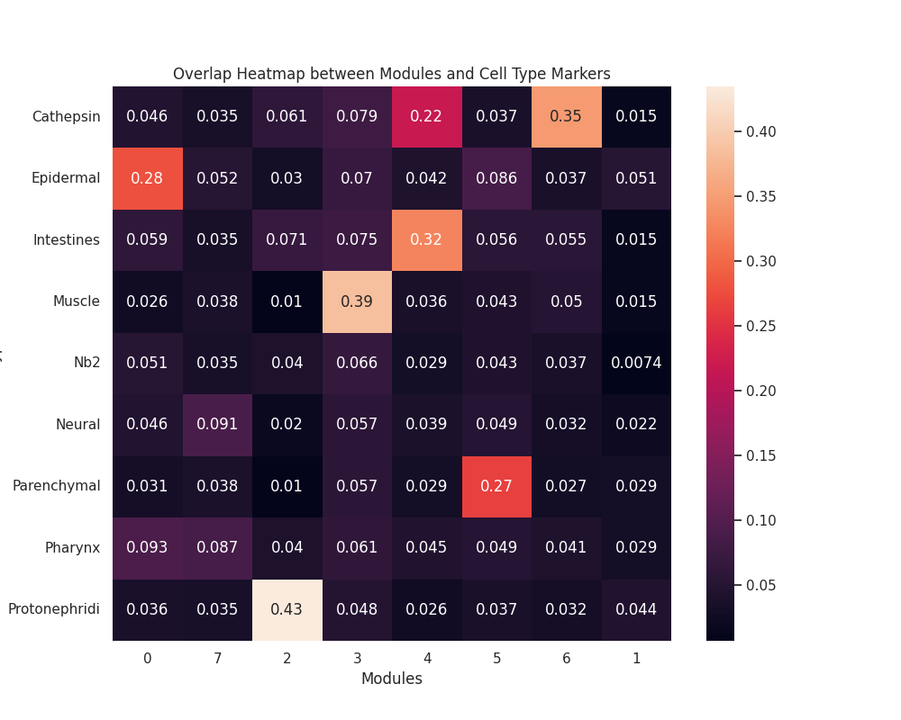
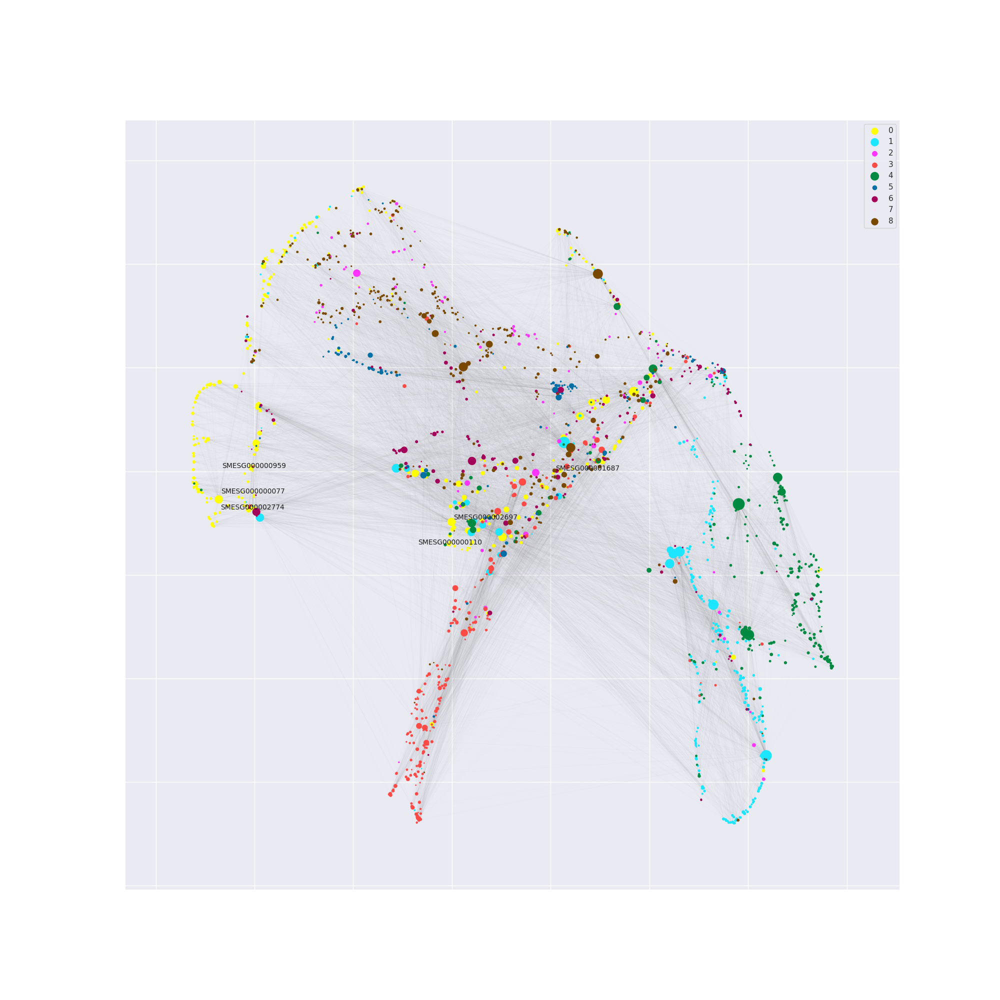
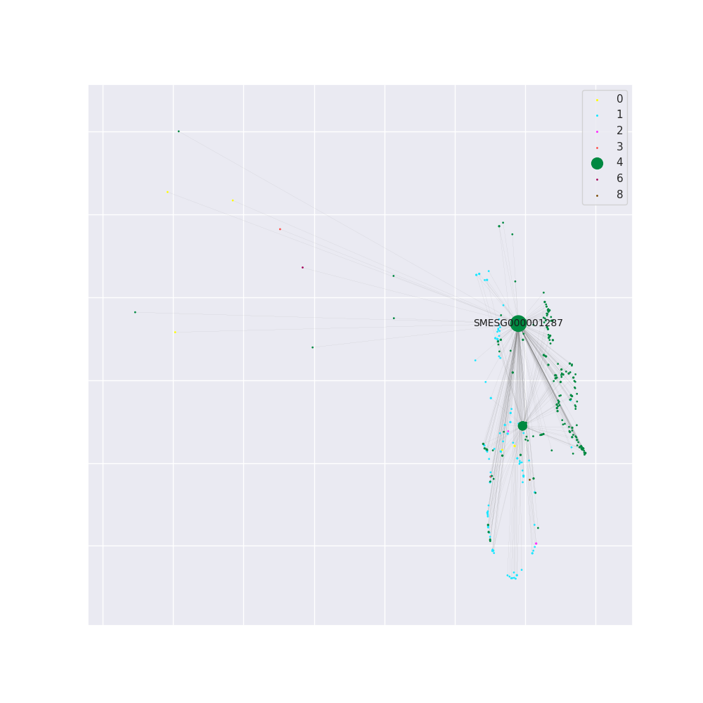

# grnm

This project aims to analyze gene regulatory networks (GRNs) by integrating archR processed gene score data and single-cell RNA sequencing (scRNA) data. The workflow consists of the following steps:

## Step 1: Preprocessing and Data Integration

After preprocessing and collecting the necessary files, the gene score data obtained from archR processing is combined with scRNA data. The combined data is then subjected to Principal Component Analysis (PCA) for dimensionality reduction. The number of genes is denoted as M, and the PCA dimensions are denoted as d. This results in an M * d1 matrix.

## Step 2: Deep Learning-based Dimensionality Reduction

The M * d1 matrix obtained from Step 1 is further processed using a deep learning model for dimensionality reduction. The resulting matrix has dimensions M * d2 in the latent space. Subsequently, Uniform Manifold Approximation and Projection (UMAP) algorithm is applied for additional dimensionality reduction, resulting in an M * 2 matrix. These coordinates serve as the basis for plotting each gene.

## Step 3: Clustering Using Louvain Algorithm

The TF-target regulatory relationships extracted from the Pando processed files are used to construct an adjacency matrix. The Louvain algorithm is then applied to perform clustering on the genes. This step allows for the identification of different modules to which each gene belongs.

## Step 4: Visualization

A series of functions are provided to generate various plots, encapsulating different attributes of the formed GRN. These functions facilitate easy visualization of the network's properties.

By following these steps and utilizing the provided functions, users can gain insights into the characteristics and dynamics of the gene regulatory networks under study.





## Pre-requisites

Before you begin, ensure you have met the following requirements:

- **Operating System**: Windows 10, Ubuntu 20.04, macOS Mojave or later.
- **Dependencies**: Ensure you have `pip` installed on your system.

## Installation Recommendations

To ensure a smooth installation and operation of our software, please follow these recommendations:

### Environment Setup

- **Python Version**: It is recommended to use Python 3.9 for optimal compatibility with our software. If you do not have Python 3.9 installed, you can download it from the [official Python website](https://www.python.org/downloads/).

### Network Stability

- **Internet Connection**: Make sure you have a stable internet connection before starting the installation process. This is crucial for downloading necessary packages and dependencies without interruption.

### Pre-installing Dependencies

- **Deep Graph Library (DGL)**: Our software relies on the Deep Graph Library (DGL) for efficient graph operations. To minimize installation issues, we recommend installing DGL before proceeding with the installation of our software.

  You can install DGL by running the following command:

  ```bash
  pip install dgl
  ```
- **grnm**:You can install drnm by running the following command:
  ```bash
  pip install grnm
  ```
  ## example
- [example Notebook](notebooks/example.ipynb)
